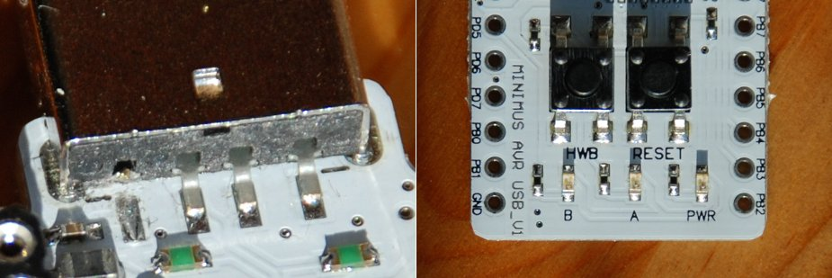

# BBC MICRO USB DISC FILING SYSTEM
The UDFS is a patched Acorn DFS ROM (based heavily on Martin Mather's patches for his MMBEEB project), which allows a "real" BBC Micro to "mount" disk images stored on a host computer (Windows, MacOSX, Linux) using a cheap USB cable.

This repository uses git submodules, so you'll need to do a recursive clone:

    git clone --recursive https://github.com/makestuff/udfs

## TODO
* BBC cannot save data to disk images yet.
* Perhaps the choice of disc image should be made by the BBC?

## SOFTWARE
You'll need CMake and a suitable compiler (GCC on Linux, MSVC on Windows) to build the code. For the 6502 code you'll need [ACME](https://sourceforge.net/projects/acme-crossass), and for the AVR code you'll need AVR-GCC.

To build the host-side software, just run `build.sh` (or `build.cmd` on Windows), which will build the `server` directory and all its dependencies:

* `server` - The actual disk-image server program.
* `common` - Common headers, etc
* `libargtable2` - Stewart Heitmann's library for parsing command-line options
* `liberror` - Simple error-handling library.
* `libusbwrap` - Wrapper around [libusb](https://libusb.info).
* `googletest` - The [GoogleTest](https://github.com/google/googletest) framework.

The AVR firmware depends on Dean Camera's [LUFA](http://www.fourwalledcubicle.com/LUFA.php). Just run `make` inside `firmware`:

* `firmware` - The firmware for the AVR microcontroller.
* `lufa` - Dean Camera's [LUFA](http://www.fourwalledcubicle.com/LUFA.php).

There are a couple of BBC ROMs, written in 6502 assembler, in ACME syntax.

* `udfs_rom` - The disk-image server ROM.
* `uptx_rom` A simple ROM for sending arbitrary commands to the host over USB.

There's also some other code here which will probably be of no use to anyone, but which I don't want to lose, so I put it here:

* `d6502`     - Hacky disassembler to get an ACME-compatible MMBEEB ROM source file.
* `mmbeeb`    - Martin Mather's MMBEEB stuff, rescued from archive.org.
* `xbm2bbc`   - Image converter to make BBC MODE4 screen-memory dumps from XBM files.
* `libbuffer` - Needed by xbm2bbc.

## HARDWARE
For the USB cable you will need a board based on the Atmel AT90USB162 or similar. Probably the cheapest option is to buy a Minimus board, which will cost about £5 (sadly no longer available). Since you want the AT90USB162 to draw power from the Beeb, you need to cut the USB power line, as shown on the left:

You then need a 20-pin IDC connector and a short (~30cm) length of ribbon cable, connected like this:

    +-------------+-------------+
    |   IDC Pin   | Minimus Pin |
    +-------------+-------------+
    |      1      |     VCC*    |
    |      2      |     PC4     |
    |      3      |     VCC*    |
    |      4      |     PC2     |
    |      5      |     GND     |
    |      6      |     PD0     |
    |      7      |     GND     |
    |      8      |     PD1     |
    |      9      |     GND     |
    |     10      |     PD2     |
    |     11      |     GND     |
    |     12      |     PD3     |
    |     13      |     GND     |
    |     14      |     PD4     |
    |     15      |     GND     |
    |     16      |     PD5     |
    |     17      |     GND     |
    |     18      |     PD6     |
    |     19      |     GND     |
    |     20      |     PD7     |
    +-------------+-------------+
    
    * Put a 10uF tantalum capacitor between VCC and GND

You need to write the `udfs_rom.bin` image to a suitable EPROM and install it in your BBC Micro. You then need to program the AT90USB162 in your Minimus board with the supplied firmware. Finally, with the cable installed in your BBC's user port and your PC's USB port, you should be able to mount a disc image:

    sudo install/bin/server -v 03eb:3002 ../images/elite_a.ssd

Hit Shift-Break on the BBC and you're away!
